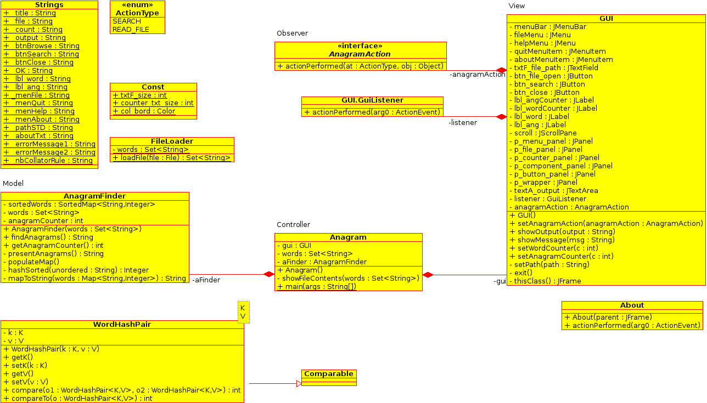

Anagram finder
=================

##Teknologi
Programmet er lagd i Java SE 1.8
Det medfølger en .project fil for enkel import av prosjektet til Eclipse IDE.

##Kompilering
`./src/Anagram.java` innholder `main()`, standasrd kompilering med `javac`. 

##Binærer
En `jar` pakke medfølger i `./jar`, kompilert og testet med JDK på Fedora 21.

##Mappestruktur
I foldern finnes det følgende:
* **src** All kildekode til progreammet i Java filer.
* **jar** Prekompilert jar fil og sh script som starter programmet. Bør fungere på de fleste Linus/BSD ditribusjoner som har JRE 1.8 installert og eventuel Mac OS (ikke testet).
* **anagrams** Inholder tre teksfiler med hvilke programmet blitt testet.
* **screenshots** Screenshots over gui. 
* **uml** Et uml klassediagram over programstrukturen.

##Algoritmer og dastastrukturer
Løsningen bygger på bruk av egenskaper til forskjellige datastrukturer og collections enn spesifikk algoritme for å finne anagrammer. Anagrammene blir funnet gjennnom følgende tilnærmingsmåte: 

1. En textfil med et-ord anagrammer lastes inn til en `Set<String>`. 

2. De inleste filene i `Set<String>` blir lagt i en `Map<String, Integer>` der integer verdien er en hashverdi av nøkkelsn (ordet) i en leksinografik rekkefølge (a-å). Slik beholdes det originale ordet i form av an nøkkel. Dette gjør at alle anagrammer kommer til å ha samme hash verdi i map strukturen. 

3. Alle par i mappen legges over i en custom datastruktur med egen komparator med hensikt å sortere disse etter den loksinografiske hash verdien. Det medfører at alle anagrammer kan nå leges over i en `ArrayList<WordHashPair<String, Integer>>` og sorteres etter sin verdi. Nå ligger alle anagramer intil hverandre. 

4. Anagramene hentes ut fra listen basert på lik verdi. 

##Patterns
* **Architectural** Programmet bygger på *model view controller* pattern.
* **Design** Det brukes en enkel observer pattern for å lytte til hendelser (actions) fra gui.

##Klassestruktur

* **Anagram** Main klasse og kontroller.
* **GUI** GUI klasse i Java Swing. 
* **FileLoader** Hjelpeklasse for lasting av tekstifler. 
* **AnagramFinder** Model klassen (business logic).
* **WordHashPair** Generisk datatype som brukes til sortering av anagramer. 
* **AnagramAction** interface brukt til observer pattern mellom GUI og controller klassene.
* **ActionType** Enum type brukt definisjoner av forskjellige "user actions".
* **Strings** Sentral string repository.
* **Const** Sentral repository av konstanter.

##Screenshots

